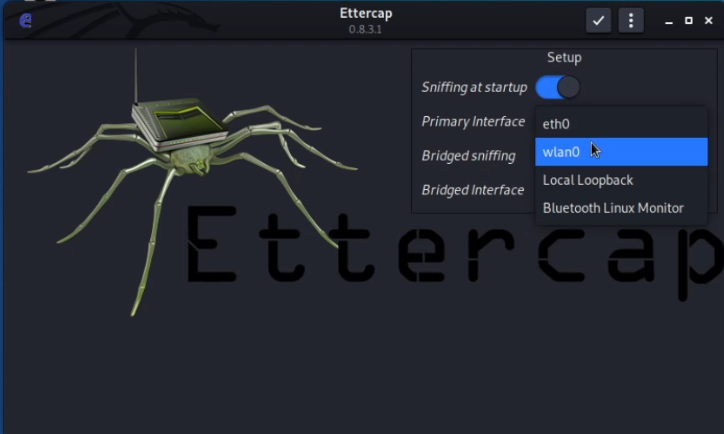

## Step 1: Select the Network Interface

Launch `ettercap` (preferably with root privileges) and select the interface connected to your network.

<!--  -->

Once selected, Ettercap will display:

> "Starting Unified sniffing"

This means Ettercap is now monitoring your network interface for activity.

---

## Step 2: Scan the Network for Hosts

Now, scan the entire network to detect active devices:

Go to `Hosts` → `Scan for hosts`.

---

## Step 3: View the List of Hosts

After the scan is complete, go to:

`Hosts` → `Hosts list`

Here you’ll see all the detected devices on your network, including their IP addresses and MAC addresses.

---

## Step 4: Set the Targets

Select the target you want to spoof:

- Add the **gateway (router)** as **Target 1**
- Add the **victim device** as **Target 2**

You can do this by right-clicking each and selecting:
- `Add to Target 1`
- `Add to Target 2`

This tells Ettercap to **poison the ARP cache** between these two machines.

---

## Step 5: Start the ARP Poisoning Attack

Click the **globe icon** (or go to `Mitm` in the menu) and select:

`ARP poisoning` → `Sniff remote connections`

This will begin the ARP spoofing attack. Ettercap will now sit in the middle of the communication between the target and the router.

---

## Step 6: Monitor the Network Traffic

Now, when the victim browses the internet or accesses a website, **you’ll see their requests flowing through your machine**.

You can analyze packets using **Ettercap** or open **Wireshark** in parallel for deeper inspection.

---

## Step 7: Test with a Login Page

To confirm that you're seeing live credentials, visit a test website from the victim’s browser:

👉 Example test login site:  
**[http://testphp.vulnweb.com/login.php](http://testphp.vulnweb.com/login.php)**

Any HTTP login credentials (not encrypted) may be intercepted and displayed in Ettercap.

---

## Final Thoughts

ARP Spoofing is a foundational technique used in many **Man-in-the-Middle (MitM)** attacks. While it’s a powerful tool for ethical hackers and penetration testers, it also highlights how **insecure HTTP traffic** can be if not protected with HTTPS.

> 🔐 Always prefer **HTTPS** websites. Never enter credentials on unsecured sites.

---
 
